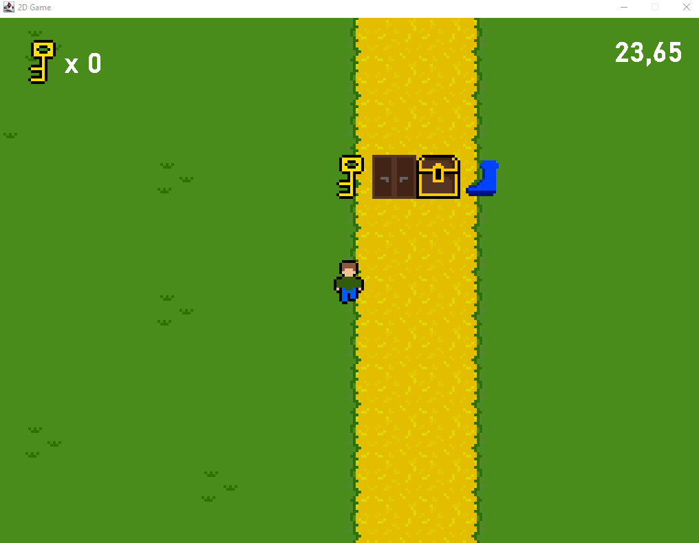
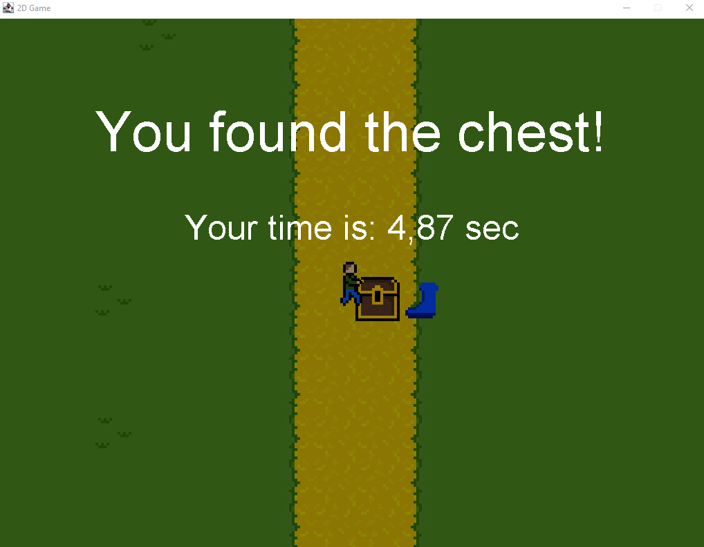

# 2DGame
Ein Java 2D Spiel, nur mit Swing/AWT gemacht. Die Assets sind alle selber gemalt und bis auf den Soundtrack(Hyrule Field - The Legend of Zelda: Ocarina Of Time) auch selber gemacht. Das Spiel mache ich nach einem Tutorial(How to Make a 2D Game in Java - RyiSnow), wobei ich ein paar Sachen selber verbessere oder implementiere, wie den Debug Mode oder die Sichtbarkeit der 
Variablen/Methoden bzw. den Aufbau und Nutzen der Variablen und Methoden selber. Bisher ist das Ziel des Spiels nur, eine Kiste mit einem Schlüssel zu öffnen, doch ich plane das Spiel nach den Tutorials zu erweitern.

Wenn du die Kiste mit dem Schlüssel geöffnet hast:

